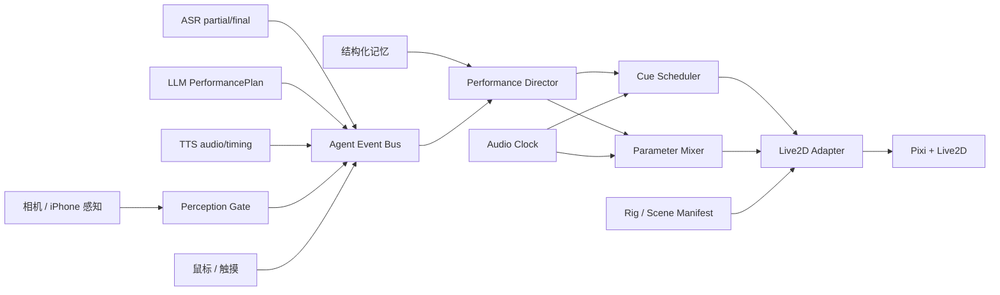

# Soyo Live2D 演出架构、协议与验收规范

## 1. 文档状态

本文定义并记录把原有“单表情、单动作、播放状态嘴型”升级为完整 Live2D 演出系统后的架构和验收门槛。本次能力以一个整体交付，不依赖按 P0/P1/P2/P3 分阶段打开功能。

当前工作树已经完成的主链路：

- `backend/app/performance.py`：严格的 `PerformancePlan` v2、`PerformanceCue`、锚点和向后兼容归一化。
- `backend/tests/test_performance.py`：契约、旧协议迁移以及 Cubism 诊断 CLI 测试。
- `scripts/inspect-live2d-model.mjs`：Cubism 2 / Cubism 4 离线模型诊断工具。
- `src/live2d/Live2DAdapter.ts`、`ModelInspector.ts`、`soyoRigProfile.ts`：Cubism 2/4 适配、运行时能力探测和 Soyo rig profile。
- `src/live2d/PerformanceDirector.ts`：状态化视线、待机调度、重复 cue、交互优先级和口型平滑导演。
- `src/live2d/Live2DStage.tsx`：已使用 adapter/director，并接入 capability callback、render quality、stage preset 和 pointer hit test。
- `src/audio/` 与 `src/conversation/ConversationOrchestrator.ts`：RMS、SpeechPlayer 和可打断 turn 编排的独立实现。
- `src/App.tsx`：已使用编排器和真实音频能量，向舞台传递 phase、audioLevel、cue nonce、gaze、scene 和 prop。
- `backend/app/dashscope.py`：LLM 提示词和 `/api/chat` 已输出规范化 `PerformancePlan`，无效整包回退而不是部分污染。
- `backend/app/device_hub.py`、`src/device-control/` 与 `ios/SoyoCompanion/`：已形成浏览器控制台、持久中继和原生 iPhone 能力端。

模型源文件、商业场景美术、服装包、音色授权和 iPhone 真机签名属于部署输入，不复制进公开仓库；没有相应资源时，运行时会报告能力缺失并安全降级。

## 2. 改造前基线与已解决问题

改造前链路为：

```text
麦克风 -> 实时 ASR -> 完整 LLM JSON -> 完整 TTS MP3 -> Audio 播放
                                   |                |
                              emotion/action     speaking=true
                                   |                |
                              表情/单个动作       正弦嘴型
```

改造中复用的能力：

- Paraformer WebSocket 会返回 partial 和 final 识别结果。
- Qwen 已支持随本轮消息发送单张相机图片。
- CosyVoice 已返回音频 chunk，只是后端目前合并完整 MP3 后才响应。
- 会话摘要已经持久化，可作为结构化角色状态的迁移来源。
- `pixi-live2d-display` 已提供 motion、expression、focus、hitTest、眨眼、呼吸和物理更新基础。
- iPhone device hub 作为经用户授权的画面和语义感知事件入口。

本次已处理的问题：

1. 默认下载脚本生成 Cubism 2 模型，而现有口型只调用 Cubism 4 的 `setParameterValueById("ParamMouthOpenY")`。Cubism 2 通常需要 `setParamFloat("PARAM_MOUTH_OPEN_Y", value)`。
2. `model.expression()` 和 `model.motion()` 实际返回 Promise，现有本地类型把它们视为 `void`；expression 候选循环会在首个调用后退出，不能可靠 fallback。
3. action 是 React 字符串状态。同一动作连续出现时值未变化，不会形成新的演出事件；动作也始终选第 0 个 motion。
4. 正弦嘴型不读取声音，停顿和辅音闭口都不准确，写参还可能被 motion/expression 的每帧更新覆盖。
5. 对话 phase、音频实例和 Live2D 表现均由 `App.tsx` 串行管理，无法安全取消旧 turn、打断或同时处理触摸与感知事件。
6. 当前模型下载器不生成 hit area；没有授权 rig 或显式 fallback 区域时，触摸命中不会工作。

## 3. 目标架构



### 3.1 职责边界

`ConversationOrchestrator`

- 为每轮生成唯一 `turnId`。
- 管理 ASR、LLM、TTS、音频播放、超时和 `AbortController`。
- 任何旧 `turnId` 返回的结果均丢弃，避免上一轮音频或动作污染下一轮。

`PerformanceDirector`

- 输入只包含高层语义事件和经过验证的 `PerformancePlan`。
- 管理层级状态机、演出通道、优先级、冷却、动作变体和取消。
- LLM 不决定底层参数、动作文件、真实持续时间或资源 URL。

`CueScheduler`

- 把 speech、character 和 time 锚点解析为音频时钟上的 cue。
- `audio.currentTime` 或 `AudioContext.currentTime` 是唯一播放时钟。
- 页面隐藏、音频暂停、重新开始和打断时重新计算或取消，不依赖一串 `setTimeout`。

`ParameterMixer`

- 按 base motion、自然运动、情绪、视线、口型的固定顺序混合。
- 在 Live2D `beforeModelUpdate` 阶段应用最终覆盖，防止参数被当前 motion 重写。
- 所有强度归一化到 `[0, 1]`，使用 attack/release 和 easing，结束后释放通道所有权。

`Live2DAdapter`

- 抽象 Cubism 2 的 `setParamFloat` 和 Cubism 4 的 `setParameterValueById`。
- await motion/expression 的真实成功结果。
- 读取 Rig Manifest 并把 `nod`、`happy`、`mouthOpen` 等逻辑能力映射到实际模型资源。
- 缺少能力时返回结构化结果，不抛出未处理 Promise，也不尝试猜测参数。

`PerceptionGate`

- 连续帧确认、置信度阈值、去重、冷却和用户许可都在进入 LLM 前完成。
- 简单挥手、出现、离开等反应优先本地执行；确实需要描述画面时才调用 Qwen VLM。
- 原始帧默认不持久化，不写入会话记忆。

## 4. PerformancePlan v2

### 4.1 标准示例

```json
{
  "schemaVersion": 2,
  "turnId": "turn-20260906-001",
  "reply": "嗯，我明白了。别太勉强自己。",
  "ttsInstruction": "轻柔、稍慢，带有安慰感。",
  "affect": {
    "primary": "worried",
    "secondary": "shy",
    "intensity": 0.68,
    "secondaryWeight": 0.2,
    "arousal": 0.32
  },
  "defaultGaze": "user",
  "cues": [
    {
      "cueId": "opening-nod",
      "channel": "gesture",
      "anchor": {"kind": "speech", "event": "start", "offsetMs": 0},
      "action": "nod",
      "intensity": 0.55,
      "durationMs": 900,
      "priority": "speech"
    },
    {
      "cueId": "soften-expression",
      "channel": "expression",
      "anchor": {"kind": "character", "charIndex": 8},
      "emotion": "shy",
      "intensity": 0.3,
      "priority": "speech"
    }
  ]
}
```

### 4.2 严格范围

| 字段 | 限制 |
| --- | --- |
| `schemaVersion` | 只能为整数 `2` |
| `turnId` / `cueId` | 1–128 字符，只允许字母、数字、点、下划线、冒号和连字符 |
| `reply` | 去除两端空白后 1–4000 字符 |
| `ttsInstruction` | 最多 100 字符 |
| `affect.primary/secondary` | `neutral/happy/sad/shy/worried/surprised/determined` |
| `intensity/arousal` | 真正的 JSON number，范围 `[0,1]`；字符串和布尔值被拒绝 |
| `secondaryWeight` | `[0,0.5]`；无 secondary 时必须为 0，有 secondary 时必须大于 0；两种情绪不能相同 |
| `defaultGaze` | `auto/user/camera/content/left/right/up/down/away` |
| `cues` | 最多 32 个，`cueId` 在计划内唯一 |
| `durationMs` | 严格整数，0–30000 ms |
| `priority` | `ambient/state/speech/interaction/critical` |

### 4.3 Cue channel

每条 cue 必须且只能带一个与 channel 匹配的 payload：

| channel | 必需字段 | 允许值 |
| --- | --- | --- |
| `gesture` | `action` | 当前七种 `AgentAction` |
| `expression` | `emotion` | 当前七种 `AgentEmotion` |
| `gaze` | `gaze` | `GazeTarget` |
| `scene` | `resourceId` | 安全标识符，后续还必须通过 Scene Manifest allowlist |
| `prop` | `resourceId` | 安全标识符，后续还必须通过 Rig Manifest allowlist |

例如 `channel=gesture` 同时携带 `emotion` 会验证失败。契约限制字符串形状不能替代资源授权检查；导演仍需拒绝 manifest 中不存在的 scene/prop。

### 4.4 节拍锚点

| kind | 结构 | 语义与限制 |
| --- | --- | --- |
| `speech` | `event=start/end`, `offsetMs` | 相对播放开始或结束；offset 为 -2000 至 10000 ms |
| `character` | `charIndex` | 相对回复 Unicode code point 位置；必须在 `0..len(reply)` |
| `time` | `atMs` | 音频开始后的绝对时间；0–120000 ms |

LLM 推荐输出 `speech` 或 `character` 锚点，不推荐猜毫秒。拿到 TTS word/phoneme mark 时，用 mark 映射 character；没有 mark 时按标点分段和音频长度估算。前端实现必须按 Unicode code point 计数，不能直接把 JavaScript UTF-16 code unit 当成协议索引。

### 4.5 Python 用法

严格验证 canonical v2：

```python
from backend.app.performance import PerformancePlan

plan = PerformancePlan.model_validate(payload)
wire_payload = plan.model_dump(mode="json", by_alias=True, exclude_none=True)
json_schema = PerformancePlan.model_json_schema()
```

兼容旧 `AgentReply`：

```python
from backend.app.performance import normalize_performance_plan

plan = normalize_performance_plan(
    {
        "reply": "你好，我在这里。",
        "emotion": "happy",
        "action": "wave",
        "ttsInstruction": "温柔地说。",
    },
    turn_id="turn-001",
)
```

旧 action 会转换成锚定于 `speech.start` 的 gesture cue；`emotionIntensity`、`actionIntensity`、`actionDurationMs` 和 `gaze` 也会保留。若调用方没有提供 turn id，归一化器生成 `legacy-<uuid>`。

还支持将 v2 放在旧返回的 `performance` 字段中，并接受便于 LLM 输出的 beat 简写：

```json
{
  "reply": "嗯，谢谢你。",
  "emotion": "shy",
  "action": "idle",
  "ttsInstruction": "轻轻地说。",
  "performance": {
    "schemaVersion": 2,
    "turnId": "turn-wrapper",
    "affect": {"primary": "shy", "intensity": 0.65, "arousal": 0.4},
    "beats": [
      {"anchor": "speech.start", "gesture": "nod", "intensity": 0.5},
      {"anchor": {"charIndex": 2}, "emotion": "happy", "intensity": 0.3}
    ]
  }
}
```

未知 enum、越界数值、模糊 cue 和未知 v2 字段会失败，而不是静默改成 neutral/idle。由 API 层决定重试 LLM、记录错误或采用显式 fallback plan。

## 5. 演出状态机

对外可见状态已经统一为：

```text
idle -> listening -> thinking -> buffering -> speaking -> idle
           ^             \             /
           └──────── interrupted <─────┘
                         |
                       error
```

`ConversationOrchestrator` 持有当前 turn 和 `AbortController`，每轮使用唯一 `turnId`。新输入、切换会话、离开页面或用户点击麦克风打断时，旧 fetch、播放 promise、字幕和 cue 都失去更新 UI 的资格；底层请求即使忽略 `AbortSignal`，晚到结果也会被隔离。

各状态的演出语义：

- `listening`：注视用户、身体轻微前倾；输入能量触发细小反馈，partial 句间停顿允许小点头。
- `thinking`：0–500 ms 保持倾听姿态；超过阈值后侧视、呼吸放慢，避免一提交就机械播放 think。
- `buffering`：保留当前情绪并做预备吸气，不做嘴型。
- `speaking`：音频时钟接管 mouth channel，默认注视用户，cue 在对应节拍执行。
- `interrupted`：80–150 ms 淡出音频，立即取消旧 cue，嘴型快速闭合并回到 listening。
- `idle`：低优先级自然运动与随机 motion，只在其他通道空闲时执行。

推荐优先级：

```text
critical/error 100 > touch/reaction 80 > speech cue 60 > state pose 40 > ambient idle 10
```

高优先级开始时暂停或取消低优先级；结束后平滑恢复，而不是直接把 action 设置为 `idle`。

## 6. 统一落地范围

这些能力属于同一套运行架构，而不是互斥阶段：

1. **模型与参数层**：`Live2DAdapter` 同时支持 Cubism 2/4，runtime 按模型格式延迟加载；`ModelInspector` 与离线 CLI 报告动作、表情、hit area、参数和缺失引用。
2. **导演与音频层**：`PerformanceDirector` 管理视线、状态姿态、待机、触摸和重复动作；`SpeechPlayer` 从真实音频计算 RMS 包络，字幕、口型和句内 cue 共用音频时钟。
3. **演出协议层**：后端严格验证 `PerformancePlan v2`，前端再次归一化；任何未知字段、直接参数名、非法资源路径或被取消 turn 都不能进入 renderer。
4. **资源层**：`StageResourceManifest` 对 scene、rig、outfit、prop、锚点、资源大小和解码纹理预算做交叉 allowlist；LLM 只能选择 catalog ID，不能提供 URL。
5. **连续性层**：文本记忆按会话持久化，历史摘要可查看；结构化关系记忆使用有界字段、显式合并和 mood 衰减，用户可重置。
6. **感知层**：`PerceptionGate` 默认关闭，只接受用户允许的来源；事件需通过置信度、三次确认、至少 500 ms 稳定、去重和冷却。原始帧不进入 gate 状态，只有单独允许的 VLM 事件可携带一次请求使用的帧。
7. **iPhone 能力层**：Device Hub 与 SwiftUI Companion 使用 v1 严格协议、短码配对、独立令牌、Keychain、TTL/nonce/幂等、手机审批、系统权限、持久审计和吊销。它扩展 Agent 能力，但不突破 iOS 沙箱。
8. **交付层**：主应用、设备控制台、Live2D/Pixi 和 Cubism 2/4 已拆成按需 chunk；四套主题、四种构图、移动端安全区、横屏、键盘态和 reduced-motion 使用同一设计系统。

以下不是代码开关，而是运行所需的外部输入：授权的 `.moc/.moc3`、动作/表情、服装与场景素材、合法音色、生产 HTTPS 域名、Apple 签名与真机权限。缺失时系统必须显示诊断并安全降级，不能用仓库内的占位物冒充授权资源。

## 7. 离线模型诊断 CLI

### 7.1 用法

```bash
node scripts/inspect-live2d-model.mjs public/models/soyo/bestdori/model.json
node scripts/inspect-live2d-model.mjs path/to/avatar.model3.json --strict
node scripts/inspect-live2d-model.mjs path/to/avatar.model3.json --compact
npm run live2d:inspect -- path/to/avatar.model3.json --strict
```

也可从 stdin 检查 settings JSON：

```bash
node -e 'process.stdout.write(JSON.stringify({model:"avatar.moc",textures:["texture.png"]}))' \
  | node scripts/inspect-live2d-model.mjs -
```

默认发现 warning 仍返回 0，便于探索不完整素材；`--strict` 在存在任何 warning 时返回 1，适合 CI。无法识别 runtime 时始终返回 1。

### 7.2 输出

- `runtime`：`cubism2`、`cubism4` 或 `unknown`。
- `motions`：group、声明数量和文件列表。
- `expressions`：名称与文件。
- `hitAreas`：命中区名称与 drawable id。
- `parameters.discovered`：从 settings、motion、expression 和 physics JSON/文本发现的参数。
- `parameters.logical`：mouthOpen、mouthForm、眼睛、视线、角度、身体和 breath 的 Cubism 2/4 alias 命中情况。
- `references`：所有引用文件、解析用途、是否存在及绝对路径。
- `warnings`：缺文件、空动作组、无表情、无 hit area、未知格式、无法证明 mouth 参数等。

CLI 不解析二进制 `.moc/.moc3`，因此 `parameters.discoveryComplete` 固定为 false。参数未发现表示“需核对 rig”，不等价于二进制模型中一定不存在。它是部署前诊断和 manifest 制作工具，不是 Live2D Editor 的替代品。

## 8. 验收门槛

### 8.1 契约与调度

- canonical v2 中未知字段、未知 enum、字符串数值、布尔数值和越界数值全部拒绝。
- 旧 `reply/emotion/action/ttsInstruction` 在不丢失语义的前提下归一化为 v2。
- 100 个录制事件顺序随机回放，最终状态确定且无未处理 Promise。
- 被取消 turn 的音频、字幕、表情和 cue 泄漏为 0。
- 相同 gesture 连续两轮均能触发，缺失 motion/expression 全部产生可观测 fallback。

### 8.2 口型与音频

- RMS 版：声音 onset/offset 到嘴型变化中位误差小于 80 ms，P95 小于 150 ms。
- 静音帧误开口比例低于 5%，mouthOpen 与归一化音频包络相关性大于 0.75。
- 音素版：音视频绝对偏差 P95 不超过 100 ms；标准中文/日文测试集中主要元音和 `b/p/m` 闭唇正确率至少 90%。
- 打断后 150 ms 内音频停止，旧播放队列被清空。

### 8.3 Live2D 表现与性能

- 状态事件到首个可见反馈 P95 小于 100 ms。
- 表情过渡 250–600 ms；归一化参数单帧变化不超过 0.2，无明显跳脸。
- 连续 30 次待机选择不连续重复同一 motion，不打断 speech/touch channel。
- 目标桌面 ≥55 FPS、近代 iPhone ≥45 FPS；30 分钟/100 轮 soak test 无持续增长的 model、texture、Audio URL 或 ticker listener。
- 已缓存场景切换小于 300 ms，冷切换小于 2 秒；20 次服装/场景切换无显著内存爬升。

### 8.4 触摸、记忆和主动感知

- 触摸命中区测试准确率至少 95%，本地反馈 P95 小于 100 ms。
- 快速连点经过聚合，不超过每 2 秒一次潜在 LLM 请求。
- 结构化偏好回归集召回至少 95%；不同用户或 session 不串数据，所有持久状态可查看和删除。
- 相机/屏幕主动感知必须显式开启并持续显示状态；原始帧默认不落盘。
- 目标事件精确率至少 90%，连续确认不少于 500 ms；主动发话默认至少冷却 30 秒。

### 8.5 端到端延迟

- 用户停止说话后，thinking 表现 100 ms 内出现。
- 当前非流式阶段记录 ASR final、LLM done、TTS done、audio started 四个时间点作为基线。
- 流式阶段在受控网络下“用户说完到首音”P95 小于 2.5 秒，目标小于 1.5 秒；分句播放空隙小于 180 ms。

## 9. 测试策略

- Pydantic 单测：枚举、强度、混合、channel payload、三种锚点、字符边界、cue 唯一性、版本迁移。
- 模型诊断测试：在临时目录创建完整 Cubism 2/4 fixture，以 `--strict` 执行真实 Node CLI。
- 前端单测：使用 fake adapter 验证状态机、优先级、取消和 fallback，不依赖真实模型。
- 音频 fixture：至少 20 条包含静音、长停顿、低音量、中文闭唇音和日文元音的固定 TTS 音频。
- 浏览器 E2E：Playwright 注入音频、pointer/touch 和 visibility 事件，断言 trace，而不是依赖截图猜动作是否发生。
- 视觉回归：授权模型固定随机种子录制关键状态，比较帧序列和参数 trace。

## 10. 发布约束

- Bestdori 下载资源只适合个人本地测试；正式场景、服装、动作和声音必须先取得明确授权。
- 自托管并锁定 Cubism runtime 版本，避免生产页面依赖两个未固定的外部 CDN 脚本。
- PerformancePlan 只能表达 allowlist 中的高层意图；提示注入不能绕过 manifest、优先级、用户许可和相机隐私策略。
- 在多用户部署结构化关系记忆或 iPhone 感知前，必须先增加用户身份隔离；当前全局 JSON session store 不构成多租户边界。
