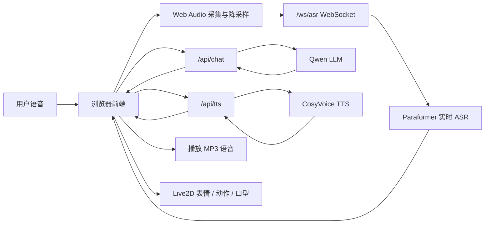

# Soyo AI 驱动虚拟偶像技术总结

> 历史基线文档（2026-09-04）：本文保留改造前的实现说明，便于对比。当前架构、PerformancePlan v2、真实音频口型、可打断编排和 iPhone Companion 以项目根目录 `README.md` 与 `docs/live2d-performance-architecture.md` 为准。

## 1. 项目定位

Soyo 是一个面向网页和移动端的实时语音 Live2D 对话原型。它把大语言模型、实时语音识别、语音合成和 Live2D 渲染串成一个完整闭环，让用户可以像和虚拟偶像通话一样进行交互：

1. 用户对着浏览器麦克风说话。
2. 前端把音频实时传给后端。
3. 后端调用实时 ASR 得到文字。
4. 前端把文字会话发给 LLM。
5. LLM 同时返回回复文本、情绪、动作和朗读语气。
6. 后端调用 TTS 合成角色语音。
7. 前端播放语音，并用 LLM 返回的情绪和动作驱动 Live2D 表情、动作和口型。

当前技术栈：

- 前端：Vite、React、PixiJS、pixi-live2d-display、Web Audio API。
- 后端：Python FastAPI。
- 云端模型：阿里云百炼 DashScope，包含 Qwen LLM、Paraformer 实时 ASR、CosyVoice TTS。
- 角色表现：Live2D Cubism 模型资源、表情文件、动作文件、前端口型参数驱动。

## 2. 总体架构



系统被拆成前端和后端两层：

- 前端负责麦克风采集、WebSocket 音频传输、用户界面、会话状态、音频播放、字幕同步和 Live2D 渲染。
- 后端负责密钥隔离、模型代理、会话存储、ASR WebSocket 转发、LLM 请求和 TTS 合成。

这种拆分的核心价值是：云端 API Key 只存在于后端环境变量中，不进入前端 bundle；同时浏览器只需要面对项目自己的 `/api` 和 `/ws`，便于本地开发、部署反代和移动端访问。

## 3. 实时语音回复链路

### 3.1 音频采集

前端通过 `navigator.mediaDevices.getUserMedia` 获取麦克风权限，并打开单声道音频输入。采集时启用浏览器侧的基础音频增强能力：

- echoCancellation：回声消除。
- noiseSuppression：噪声抑制。
- autoGainControl：自动增益。

浏览器原始采样率通常是 44.1 kHz 或 48 kHz，而当前 ASR 服务要求 16 kHz PCM。因此前端会在 `audio.ts` 中把 Float32 音频帧降采样为 16 kHz，并转换为 16 bit little-endian PCM。每个音频块通过 WebSocket 以二进制帧持续发送给后端。

### 3.2 实时 ASR 代理

前端连接：

```text
WS /ws/asr?model=paraformer-realtime-v2
```

连接建立后，前端发送：

```json
{ "type": "start" }
```

后端收到 start 后连接 DashScope WebSocket，并创建 ASR run-task。真实音频帧从浏览器传到 FastAPI，再由 FastAPI 转发给 Paraformer。DashScope 返回识别结果后，后端把它归一化为前端易处理的消息：

```json
{
  "type": "asr-result",
  "text": "用户说的话",
  "final": true
}
```

当前实现里，前端监听到 `final: true` 且文本非空后，会自动停止本轮录音，并把最终识别文本提交给智能体。

### 3.3 LLM 回复生成

前端把用户消息和最近会话历史提交到：

```text
POST /api/chat
```

请求体包含：

```json
{
  "messages": [
    { "role": "user", "content": "你好" }
  ],
  "model": "qwen-plus-latest",
  "temperature": 0.75
}
```

后端调用 DashScope OpenAI 兼容 Chat Completions 接口，并通过系统提示词约束模型输出 JSON。LLM 不只生成一句文字回复，还要同时生成可被前端执行的角色控制信号：

```json
{
  "reply": "嗯，我在这里。今天想和我聊些什么呢？",
  "emotion": "happy",
  "action": "nod",
  "ttsInstruction": "语气温柔、自然，带一点轻松的笑意。"
}
```

字段含义：

- `reply`：最终对用户说出的内容，要求简短、自然、适合语音朗读。
- `emotion`：角色表情状态，只允许固定枚举。
- `action`：角色动作状态，只允许固定枚举。
- `ttsInstruction`：给 TTS 的朗读风格提示，控制语气、情绪和节奏。

后端会对 LLM 输出做容错处理：如果 JSON 解析失败、字段缺失或枚举越界，就使用 fallback 回复或回退到 `neutral` / `idle`，避免前端收到不可执行的控制指令。

### 3.4 语音合成

拿到 LLM 回复后，前端调用：

```text
POST /api/tts
```

请求体包含回复文本、朗读指令、情绪、TTS 模型和音色：

```json
{
  "text": "嗯，我在这里。今天想和我聊些什么呢？",
  "instruction": "语气温柔、自然，带一点轻松的笑意。",
  "emotion": "happy",
  "model": "cosyvoice-v3.5-flash"
}
```

后端通过 CosyVoice WebSocket 合成 MP3，返回：

- 响应体：`audio/mpeg`。
- 响应头：`X-Soyo-TTS-Voice`，用于标识实际命中的 voice id。

项目支持 Soyo 双音色：

- `TTS_VOICE_SOYO_SOFT`：偏柔和、偏可爱的声音。
- `TTS_VOICE_SOYO_NATURAL`：更自然、克制的声音。

在自动模式下，后端根据情绪选音色：

- `happy`、`shy`、`surprised` 使用 soft。
- 其他情绪使用 natural。

这样，LLM 的情绪判断不仅影响 Live2D 表情，也会影响角色声音的质感。

### 3.5 播放与字幕同步

前端收到 MP3 Blob 后创建 object URL，并用浏览器 `Audio` 对象播放。播放期间系统状态切换为 `speaking`。

为了让文字回复和声音更贴近，前端会根据音频播放进度估算当前应显示的文本长度，实现逐字出现的同步字幕效果。音频结束后，完整 assistant 消息才正式写入会话历史。

如果音频播放失败，系统仍会提交文字回复，避免一次 TTS 或浏览器播放错误导致整轮对话丢失。

## 4. 大模型如何驱动 Live2D

### 4.1 不是直接驱动模型参数，而是输出角色协议

当前 Soyo 的设计并不是让 LLM 直接生成 Live2D 参数，例如 `ParamAngleX`、`ParamEyeLOpen` 或动作文件名。直接暴露底层参数会带来几个问题：

- LLM 容易输出不存在的参数或动作名。
- 不同 Live2D 模型的 motion / expression 命名不一致。
- 底层参数过细，难以稳定表达“开心”“害羞”“安慰”等高层语义。

因此项目采用中间协议：LLM 输出有限枚举的 `emotion` 和 `action`，前端再把它们映射到具体 Live2D 资源。

当前支持的情绪：

```text
neutral, happy, sad, shy, worried, surprised, determined
```

当前支持的动作：

```text
idle, nod, wave, think, comfort, deny, excited
```

这个协议层相当于把“语言理解和角色决策”与“Live2D 资源执行”解耦。后续替换模型资源时，只需要调整映射表，不需要重新训练或大改提示词。

### 4.2 情绪到表情的映射

前端映射表位于 `src/live2d/live2dMaps.ts`。例如：

```ts
happy -> ["smile01", "smile02", "happy", "Smile", "smile"]
sad -> ["sad01", "sad02", "sad", "Sad"]
shy -> ["shame01", "shame02", "shy", "Blush"]
```

每个情绪会对应多个候选 expression 名称。执行时前端按顺序尝试调用：

```ts
model.expression(expressionName)
```

只要某个 expression 存在并成功执行，就停止尝试。这样可以兼容不同 Live2D 模型资源的命名差异。例如一个模型可能叫 `smile01`，另一个模型可能叫 `Smile`。

### 4.3 动作到 motion 的映射

动作映射同样在 `live2dMaps.ts` 中：

```ts
idle -> ["Idle"]
nod -> ["TapBody", "Nod"]
wave -> ["Wave", "TapHead"]
think -> ["Think", "TapBody"]
comfort -> ["Comfort", "TapBody"]
deny -> ["Deny", "Shake"]
excited -> ["Excited", "TapBody"]
```

前端会读取模型内部的 motion definitions，检查候选动作组是否存在：

```ts
const definitions = model.internalModel?.motionManager?.definitions ?? {};
const group = motionByAction[action].find((candidate) => candidate in definitions) ?? "Idle";
model.motion(group, 0, 3);
```

如果目标动作不存在，系统会回退到 `Idle`。这让 LLM 可以稳定输出高层动作意图，而不会因为资源缺少某个 motion 造成前端异常。

### 4.4 说话口型驱动

角色说话时，前端不依赖 TTS 返回音素级 viseme 数据，而是用播放状态驱动 Live2D 嘴型参数：

```text
ParamMouthOpenY
```

当 `phase === "speaking"` 时，Pixi ticker 会按正弦节奏周期性设置嘴巴开合值：

```text
0.25 + abs(sin(t)) * 0.75
```

当不在 speaking 状态时，嘴巴开合值归零。

这种方式实现成本低、兼容性好，适合原型阶段。它不能做到音素级精准口型，但足以营造“角色正在说话”的实时反馈。

### 4.5 状态机协同

前端用 `phase` 管理角色交互状态：

```text
idle -> listening -> thinking -> speaking -> idle
```

各状态对应的表现：

- `listening`：麦克风打开，WebSocket 持续发送 PCM，UI 显示正在听。
- `thinking`：ASR 已结束，等待 LLM 和 TTS。
- `speaking`：播放 TTS 音频，Live2D 口型开始运动，字幕同步展开。
- `idle`：回到待机，动作重置为 `idle`。
- `error`：展示错误状态，但尽量保留文字回复。

LLM 输出的 `emotion` 和 `action` 会在 TTS 生成前先设置到前端状态，因此角色可以先切换表情和动作，再进入说话阶段。

## 5. 后端关键接口

### GET /api/config

返回运行时配置，包括 LLM / ASR / TTS 模型名、默认音色、Soyo 双音色、Live2D 模型路径和密钥是否就绪。

### WS /ws/asr

浏览器实时语音识别入口。前端发送 16 kHz PCM 二进制帧，后端转发到 DashScope Paraformer，并把结果封装成 `asr-status`、`asr-result`、`asr-error`。

### POST /api/chat

LLM 智能体入口。输入会话消息，输出结构化 `AgentReply`：

```ts
type AgentReply = {
  reply: string;
  emotion: AgentEmotion;
  action: AgentAction;
  ttsInstruction: string;
};
```

### POST /api/tts

语音合成入口。输入回复文本、情绪、朗读提示和音色配置，输出 MP3。后端会根据 emotion 自动选择 soft / natural 音色，也允许前端显式传入 custom voice。

### /api/sessions

会话历史读写接口。后端把历史保存到 JSON 文件，便于刷新页面后继续保留对话记录。

## 6. 当前方案的优点

### 6.1 实时性较好

音频采集和 ASR 使用 WebSocket 流式传输，用户说话时即可获得中间识别结果。最终句子结束后立即进入 LLM 和 TTS 阶段，整体路径短，适合实时聊天。

### 6.2 协议稳定

LLM 输出被限制为 JSON 和固定枚举，前端只需要处理少量稳定状态。相比让模型输出自由文本指令，这种方式更可控、更容易测试。

### 6.3 表现层可替换

Live2D 资源和 LLM 决策之间有映射表隔离。后续替换角色模型、增加动作、调整表情命名时，只需要更新 `live2dMaps.ts` 和资源文件，不影响语音链路。

### 6.4 情绪贯穿多模态

同一个 `emotion` 同时影响：

- 回复文本风格。
- Live2D 表情。
- Live2D 动作。
- TTS 音色选择。
- TTS 朗读提示。

这让角色表现更统一，不会出现“文字很开心、表情很严肃、声音很平”的割裂感。

## 7. 可以继续演进的方向

### 7.1 流式 LLM 与流式 TTS

当前流程是 ASR final 后调用 LLM，LLM 完整返回后再调用 TTS，TTS 完整 MP3 返回后播放。后续可以改成：

```text
ASR final -> LLM stream -> 句子级 TTS stream -> 边生成边播放
```

这样能显著缩短首字响应时间，让虚拟偶像更接近真人通话体验。

### 7.2 更精细的口型同步

当前口型是基于播放状态的周期动画。后续可以接入：

- TTS 音频能量分析，按实时音量驱动嘴巴开合。
- 音素 / viseme 时间轴，驱动更精准的口型。
- 眨眼、呼吸、身体轻微摆动等待机动画参数。

### 7.3 更丰富的动作协议

可以扩展 LLM 输出：

```json
{
  "emotion": "happy",
  "action": "wave",
  "gaze": "left",
  "intensity": 0.8,
  "durationMs": 1200
}
```

其中 `intensity` 可用于控制表情强度、动作优先级或镜头反馈，`durationMs` 可用于编排动作时长。

### 7.4 角色长期记忆

当前会话历史主要按 session 保存。后续可以增加长期记忆模块，把用户偏好、称呼、重要事件抽取为结构化记忆，在 LLM system/context 中注入，提升陪伴感和连续性。

### 7.5 更严格的内容和授权边界

项目涉及虚拟角色资源和声音样本。正式发布时应确保：

- Live2D 模型资源有明确授权。
- 音色训练样本有合法使用权。
- 不公开发布未经授权的角色仿声。
- 对外展示时避免声称自己是真实人物或官方角色。

## 8. 一句话总结

Soyo 的核心技术路线是：用实时 ASR 把用户语音转成文本，用 LLM 同时生成回复内容和角色控制协议，用 TTS 合成带情绪提示的语音，再由前端把协议映射成 Live2D 表情、动作和口型。大模型在这里扮演的是“角色大脑”和“演出导演”，而 Live2D 前端则负责把它的高层意图稳定地翻译成可见、可听、可互动的虚拟偶像表现。
