# Soyo AI 虚拟偶像图解版

> 历史基线图解（2026-09-04）：其中“当前/后续”描述的是重构前状态。最新实现已经接入 PerformancePlan v2、音频时钟口型、turn 打断、Live2D 能力探测和 iPhone Companion，请以项目根目录 `README.md` 与 `docs/live2d-performance-architecture.md` 为准。

## 一屏总览

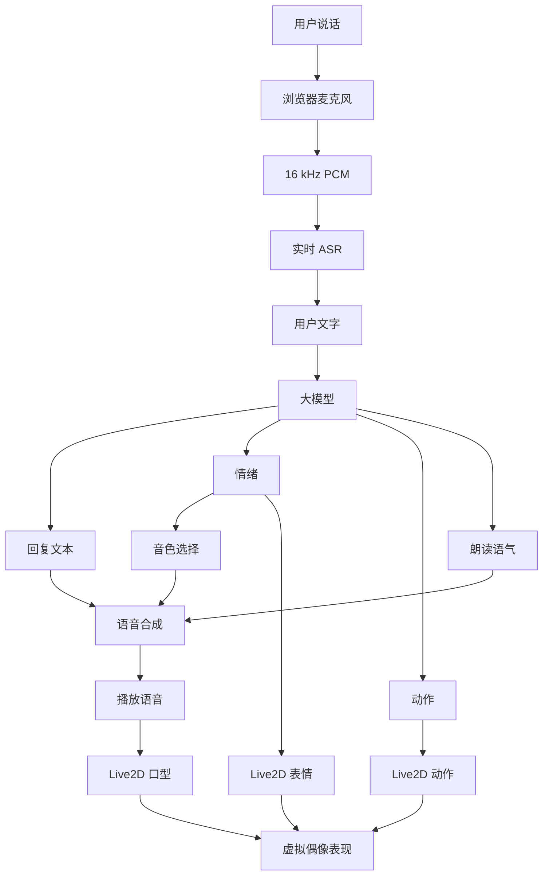

## 实时语音回复

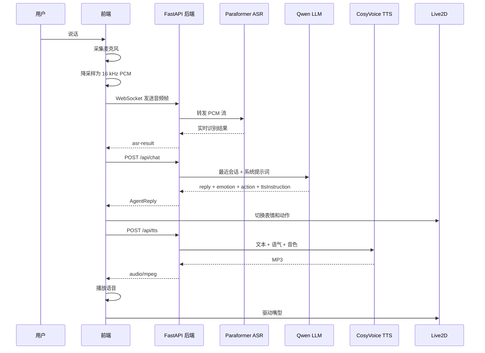

## 前后端分工

| 模块 | 负责什么 | 关键文件 |
| --- | --- | --- |
| 浏览器采音 | 麦克风权限、降采样、PCM 编码 | `src/audio.ts` |
| 前端会话 | 状态机、接口调用、字幕同步、音频播放 | `src/App.tsx` |
| Live2D 舞台 | PixiJS 渲染、模型加载、表情动作执行、口型参数 | `src/live2d/Live2DStage.tsx` |
| 表情动作映射 | 把 LLM 高层语义映射成 expression / motion | `src/live2d/live2dMaps.ts` |
| 后端 API | 配置、会话、chat、tts、asr WebSocket | `backend/app/main.py` |
| 模型代理 | DashScope LLM / ASR / TTS 调用 | `backend/app/dashscope.py` |

## 状态机

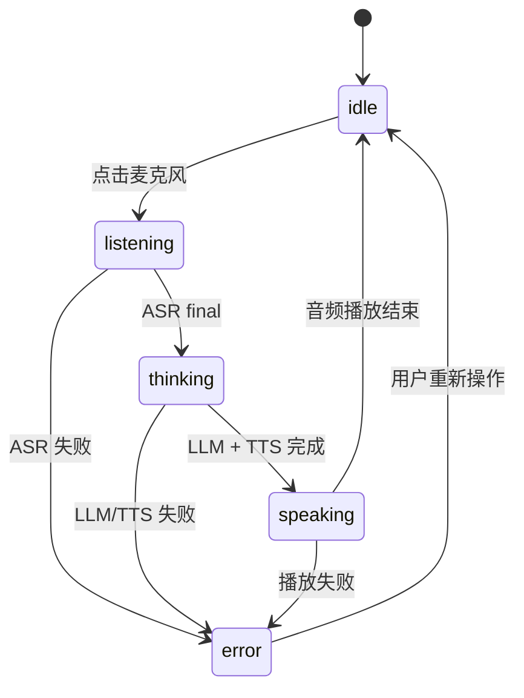

## 大模型输出协议

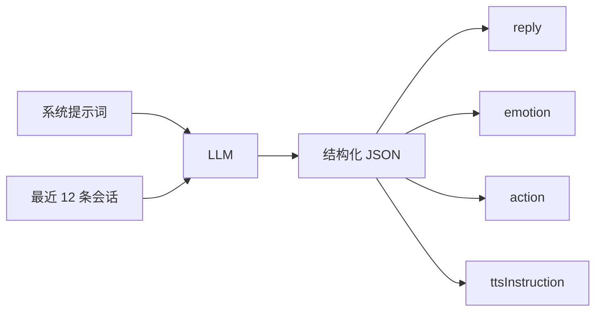

```json
{
  "reply": "嗯，我在这里。今天想和我聊些什么呢？",
  "emotion": "happy",
  "action": "nod",
  "ttsInstruction": "语气温柔、自然，带一点轻松的笑意。"
}
```

## Live2D 驱动方式

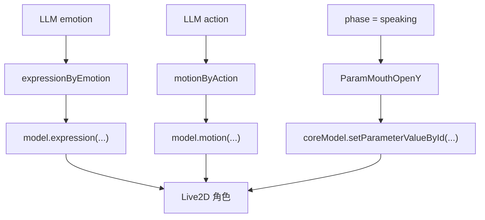

## 情绪映射

| LLM 情绪 | Live2D 表情候选 | 声音倾向 |
| --- | --- | --- |
| `neutral` | `default`, `idle01`, `neutral`, `Normal` | natural |
| `happy` | `smile01`, `smile02`, `happy`, `Smile` | soft |
| `sad` | `sad01`, `sad02`, `Sad` | natural |
| `shy` | `shame01`, `shame02`, `Blush` | soft |
| `worried` | `thinking01`, `odoodo01`, `Worried` | natural |
| `surprised` | `surprised01`, `Surprised` | soft |
| `determined` | `serious01`, `serious02`, `Determined` | natural |

## 动作映射

| LLM 动作 | Live2D motion 候选 |
| --- | --- |
| `idle` | `Idle` |
| `nod` | `TapBody`, `Nod` |
| `wave` | `Wave`, `TapHead` |
| `think` | `Think`, `TapBody` |
| `comfort` | `Comfort`, `TapBody` |
| `deny` | `Deny`, `Shake` |
| `excited` | `Excited`, `TapBody` |

## 语音与表演同步

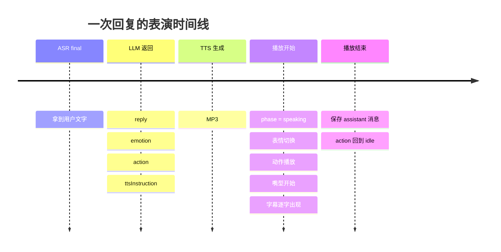

## 音色选择

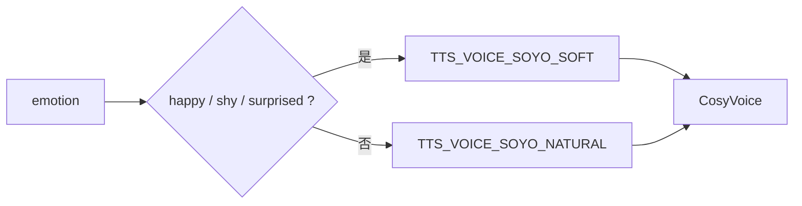

## 核心设计

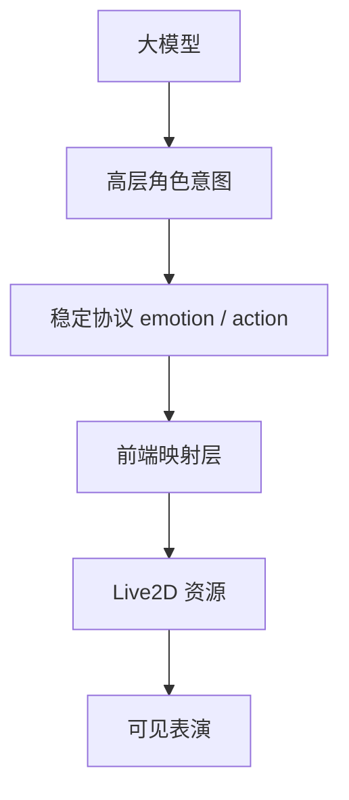

重点是：大模型不直接操作底层 Live2D 参数，而是输出稳定的角色意图。前端再把意图翻译成具体表情、动作和嘴型。

## 后续升级图

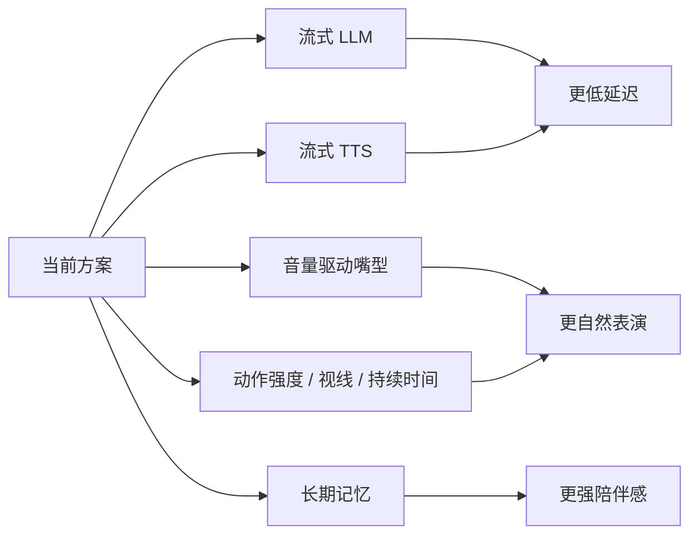

## 后续升级详表

### 1. 流式 LLM

| 项目 | 当前实现 | 主要问题 | 改进方向 |
| --- | --- | --- | --- |
| 回复生成 | 前端调用 `/api/chat`，后端等待 Qwen 完整返回 JSON 后再响应 | 用户说完后要等待完整 LLM 回复，首字延迟较高 | 改为流式 Chat Completions，先生成可朗读文本片段 |
| 表情动作 | LLM 一次性返回 `emotion` 和 `action` | 表演只能在完整回复后开始，情绪变化不够细腻 | 让模型先输出第一帧控制信号，再按句子输出后续情绪变化 |
| 输出协议 | 单个 JSON：`reply/emotion/action/ttsInstruction` | 不适合边生成边播放，因为 JSON 必须完整才可解析 | 拆成事件流，例如 `control`、`text_delta`、`sentence_end` |

建议事件格式：

```json
{ "type": "control", "emotion": "happy", "action": "nod", "ttsInstruction": "语气轻柔。" }
{ "type": "text_delta", "text": "嗯，我在这里。" }
{ "type": "sentence_end" }
```

升级后链路：

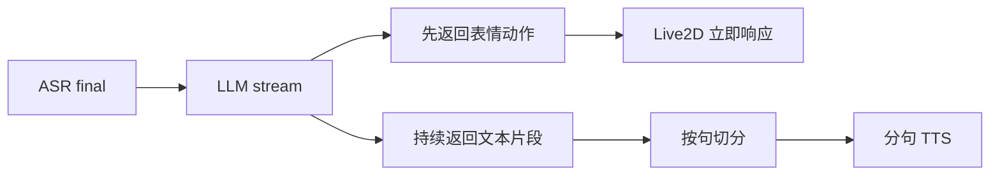

### 2. 流式 TTS 与边播边生成

| 项目 | 当前实现 | 主要问题 | 改进方向 |
| --- | --- | --- | --- |
| TTS 调用 | `/api/tts` 等待 CosyVoice 完整 MP3 合成结束后返回 | 必须等整段音频完成才能播放 | 后端改为流式音频响应或 WebSocket 音频下发 |
| 播放策略 | 前端拿到完整 Blob 后创建 `Audio` 播放 | 首音延迟高，长回复体验明显变慢 | 使用 MediaSource 或 Web Audio 队列，边收边播 |
| 回复粒度 | 一整段 reply 合成一次音频 | 长文本无法提前播放第一句 | LLM 按句输出，TTS 按句合成，前端维护播放队列 |

目标体验：

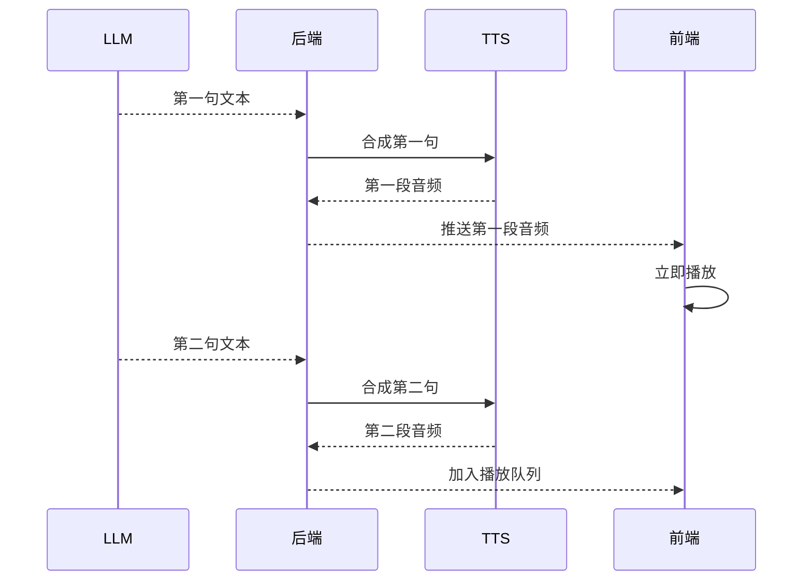

### 3. 更精准的口型同步

| 项目 | 当前实现 | 主要问题 | 改进方向 |
| --- | --- | --- | --- |
| 嘴型驱动 | `phase === speaking` 时，用正弦波周期性设置 `ParamMouthOpenY` | 嘴巴开合和真实音量、音节不匹配 | 用音频能量实时驱动嘴巴开合 |
| 音频分析 | 当前没有分析播放音频 | 停顿时嘴巴仍可能机械开合 | 使用 Web Audio `AnalyserNode` 获取 RMS 音量 |
| 音素同步 | 当前没有 phoneme / viseme 时间轴 | 无法做到日语、中文口型差异 | 如果 TTS 支持时间戳，可映射到 Live2D 嘴型和表情参数 |

分阶段升级：

| 阶段 | 实现方式 | 难度 | 效果 |
| --- | --- | --- | --- |
| V1 | 根据音频 RMS 音量控制 `ParamMouthOpenY` | 低 | 嘴巴跟随响度，停顿更自然 |
| V2 | 按句子标点加入停顿权重 | 中 | 语气节奏更像真人 |
| V3 | 音素 / viseme 时间轴驱动嘴型 | 高 | 口型和发音最贴合 |

### 4. 更丰富的 Live2D 表演协议

| 项目 | 当前实现 | 主要问题 | 改进方向 |
| --- | --- | --- | --- |
| 情绪 | 固定枚举：`neutral/happy/sad/shy/worried/surprised/determined` | 情绪强度不可表达 | 增加 `intensity`，控制表情强弱 |
| 动作 | 固定枚举：`idle/nod/wave/think/comfort/deny/excited` | 动作持续时间、优先级不可控 | 增加 `durationMs`、`priority` |
| 视线 | 当前没有 gaze 控制 | 角色眼神较固定 | 增加 `gaze`，控制看向用户、左侧、下方等 |
| 姿态 | 当前主要依赖 motion 文件 | 缺少微动作和待机变化 | 增加呼吸、眨眼、身体轻摆等参数层控制 |

建议协议：

```json
{
  "reply": "嗯，我明白了。",
  "emotion": "worried",
  "emotionIntensity": 0.7,
  "action": "think",
  "actionDurationMs": 1400,
  "gaze": "down",
  "ttsInstruction": "语气轻柔，稍微迟疑。"
}
```

### 5. 多轮记忆与角色连续性

| 项目 | 当前实现 | 主要问题 | 改进方向 |
| --- | --- | --- | --- |
| 会话历史 | 后端 JSON 保存 session 消息 | 只能保留对话文本，不会提炼长期偏好 | 增加用户画像和长期记忆表 |
| LLM 上下文 | 请求时带最近消息 | 长会话会被截断，重要信息可能丢失 | 对历史做摘要，把关键事实注入 system/context |
| 角色关系 | 每轮主要依赖当前上下文 | 陪伴感和熟悉感不足 | 记录称呼、偏好、重要事件、禁忌话题 |

建议记忆结构：

```json
{
  "userProfile": {
    "preferredName": "用户称呼",
    "likes": ["喜欢的话题"],
    "dislikes": ["不希望被提起的内容"]
  },
  "relationshipMemory": [
    { "date": "2026-06-21", "fact": "用户正在制作 Soyo 虚拟偶像项目" }
  ]
}
```

### 6. 打断与半双工/全双工对话

| 项目 | 当前实现 | 主要问题 | 改进方向 |
| --- | --- | --- | --- |
| 对话模式 | 用户说完、ASR final 后，角色再回复 | 角色说话时用户难以自然打断 | 播放期间继续监听唤醒或打断语音 |
| 音频播放 | 一段 Audio 播放到结束 | 用户中途想插话时响应慢 | 支持停止当前播放、清空 TTS 队列 |
| 状态管理 | `listening/thinking/speaking` 串行切换 | 不适合更自然的实时通话 | 引入输入流、输出流、播放队列三个并行状态 |

升级后状态拆分：

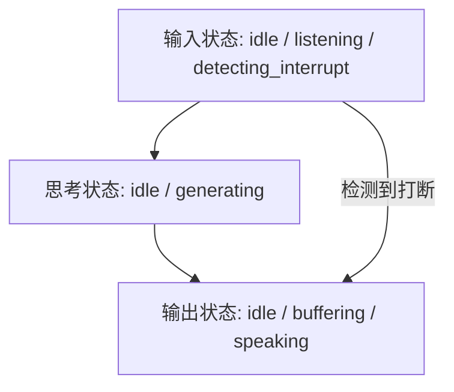

### 7. 工程稳定性与观测

| 项目 | 当前实现 | 主要问题 | 改进方向 |
| --- | --- | --- | --- |
| 错误处理 | 前端显示错误，后端抛出 HTTP 500 | 难以定位具体是 ASR、LLM、TTS 还是播放失败 | 增加结构化错误码和链路 trace id |
| 性能指标 | 目前主要靠体感 | 不清楚延迟瓶颈在哪一段 | 记录 ASR 耗时、LLM 首 token、TTS 首包、播放开始时间 |
| 降级策略 | TTS 失败时显示文字回复 | 云服务异常时体验下降明显 | 增加备用模型、备用音色、纯文本模式 |

建议埋点：

| 指标 | 含义 |
| --- | --- |
| `asr_final_latency_ms` | 用户停止说话到拿到最终转写的耗时 |
| `llm_first_token_ms` | 提交文本到 LLM 首 token 的耗时 |
| `llm_done_ms` | LLM 完整回复耗时 |
| `tts_first_audio_ms` | TTS 首个音频包耗时 |
| `audio_play_start_ms` | 前端开始播放耗时 |
| `end_to_end_ms` | 用户说完到角色开口的总延迟 |

## 推荐升级优先级

| 优先级 | 升级项 | 原因 |
| --- | --- | --- |
| P0 | 记录端到端延迟指标 | 先知道慢在哪里，后续优化才有方向 |
| P1 | 流式 LLM + 分句 TTS | 对实时感提升最大 |
| P1 | 音频能量驱动口型 | 实现成本低，表演提升明显 |
| P2 | 更丰富的表演协议 | 让 Live2D 从“会动”变成“会演” |
| P2 | 打断机制 | 更接近自然语音通话 |
| P3 | 长期记忆 | 提升陪伴感，但需要隐私和产品策略配合 |
